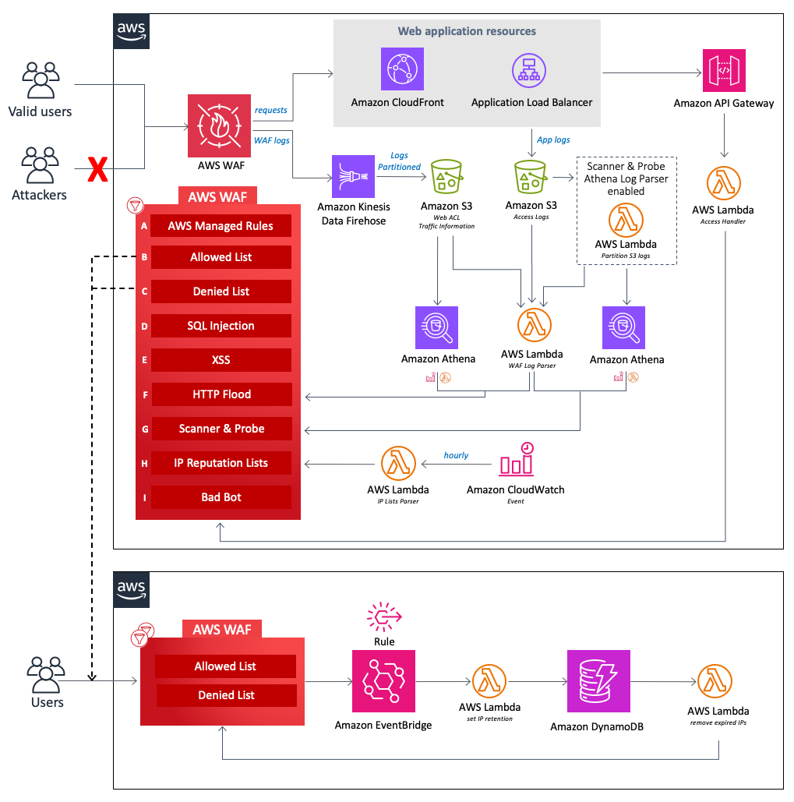

**[🚀 Solution Landing Page](https://aws.amazon.com/solutions/implementations/security-automations-for-aws-waf)** | **[🚧 Feature request](https://github.com/aws-solutions/aws-waf-security-automations/issues/new?assignees=&labels=feature-request%2C+enhancement&template=feature_request.md&title=)** | **[🐛 Bug Report](https://github.com/aws-solutions/aws-waf-security-automations/issues/new?assignees=&labels=bug%2C+triage&template=bug_report.md&title=)**

**Note:** If you want to use the solution without building from source, navigate to Solution Landing Page.

## Table of contents

- [Solution Overview](#solution-overview)
- [Architecture Diagram](#architecture-diagram)
- [Customizing the Solution](#customizing-the-solution)
  - [Prerequisites for Customization](#prerequisites-for-customization)
  - [Build](#build)
  - [Upload Deployment Assets](#upload-deployment-assets)
  - [Deploy](#deploy)
- [File Structure](#file-structure)
- [License](#license)

<a name="solution-overview"></a>

# Solution overview

The Security Automations for AWS WAF solution automatically deploys a set of AWS WAF (web application firewall) rules that filter common web-based attacks. Users can select from preconfigured protective features that define the rules included in an AWS WAF web access control list (web ACL). Once deployed, AWS WAF protects your Amazon CloudFront distributions or Application Load Balancers by inspecting web requests.

You can use AWS WAF to create custom, application-specific rules that block attack patterns to ensure application availability, secure resources, and prevent excessive resource consumption.

You can install this solution in your AWS accounts by launching the provided AWS CloudFormation template.

For a detailed solution implementation guide, refer to Solution Landing Page [Security Automations for AWS WAF](https://aws.amazon.com/solutions/implementations/security-automations-for-aws-waf).

<a name="architecture-diagram"></a>

# Architecture diagram

<p align="center">
  
  <br/>
</p>

*Security Automations for AWS WAF architecture*

The components of this solution can be grouped into the following areas of protection. 

**Note:** The group labels don’t reflect the priority level of the WAF rules.

* **AWS Managed Rules (A)** – This component contains AWS Managed Rules IP reputation rule groups, baseline rule groups, and use-case specific rule groups. These rule groups protect against exploitation of common application vulnerabilities or other unwanted traffic, including those described in OWASP publications, without having to write your own rules.
* **Manual IP lists (B and C)** – These components create two AWS WAF rules. With these rules, you can manually insert IP addresses that you want to allow or deny. You can also configure IP retention and remove expired IP addresses from these IP lists. 
* **SQL Injection (D) and XSS (E)** – These components configure two AWS WAF rules that are designed to protect against common SQL injection or cross-site scripting (XSS) patterns in the URI, query string, or body of a request.
* **HTTP Flood (F)** – This component protects against attacks that consist of a large number of requests from a particular IP address, such as a web-layer DDoS attack or a brute-force login attempt.
* **Scanner and Probe (G)** – This component parses application access logs searching for suspicious behavior, such as an abnormal amount of errors generated by an origin. Then it blocks those suspicious source IP addresses for a customer-defined period of time. 
* **IP Reputation Lists (H)** – This component is the IP Lists Parser Lambda function that checks third-party IP reputation lists hourly for new ranges to block. These lists include the Spamhaus Don’t Route Or Peer (DROP) and Extended DROP (EDROP) lists, the Proofpoint Emerging Threats IP list, and the Tor exit node list.
* **Bad Bot (I)** – This component automatically sets up a honeypot, which is a security mechanism intended to lure and deflect an attempted attack. 

<a name="customizing-the-solution"></a>

# Customizing the solution

<a name="prerequisites-for-customization"></a>

## Prerequisites for customization

- [AWS Command Line Interface](https://aws.amazon.com/cli/)
- Python 3.10

<a name="build"></a>

## Build

Building from GitHub source allows you to modify the solution, such as adding custom actions or upgrading to a new release. The process consists of downloading the source from GitHub, creating Amazon S3 buckets to store artifacts for deployment, building the solution, and uploading the artifacts to S3 buckets in your AWS account.

#### 1. Clone the repository

Clone or download the repository to a local directory on your Linux client. 

**Note:** If you intend to modify the source code, can create your own fork of the GitHub repo and work from that. This way, you can check in your changes to your private copy of the solution.

**Git Clone example:**

```
git clone https://github.com/aws-solutions/aws-waf-security-automations.git
```

**Download Zip example:**

```
wget https://github.com/aws-solutions/aws-waf-security-automations/archive/master.zip
```

#### 2. Unit test

Next, run unit tests to ensure that your customized code passes the tests:

```
cd <rootDir>/deployment
chmod +x ./run-unit-tests.sh
./run-unit-tests.sh
```

#### 3. Create S3 buckets for storing deployment assets

AWS Solutions use two buckets:

- One global bucket that you access with the http endpoint. AWS CloudFormation templates are stored here. For example, `mybucket`.
- One regional bucket for each AWS Region where you plan to deploy the solution. Use the name of the global bucket as the prefix of the bucket name, and suffix it with the region name. Regional assets such as Lambda code are stored here. For example, `mybucket-us-east-1`.

The assets in buckets must be accessible by your account.

#### 4. Declare enviroment variables

```
export TEMPLATE_OUTPUT_BUCKET=<YOUR_TEMPLATE_OUTPUT_BUCKET> # Name of the global bucket where CloudFormation templates are stored
export DIST_OUTPUT_BUCKET=<YOUR_DIST_OUTPUT_BUCKET> # Name for the regional bucket where regional assets are stored
export SOLUTION_NAME=<SOLUTION_NAME> # name of the solution.
export VERSION=<VERSION> # version number for the customized code
export AWS_REGION=<AWS_REGION> # region where the solution is deployed
```

#### 5. Build the solution

```
cd <rootDir>/deployment
chmod +x ./build-s3-dist.sh && ./build-s3-dist.sh $TEMPLATE_OUTPUT_BUCKET $DIST_OUTPUT_BUCKET $SOLUTION_NAME $VERSION
```

<a name="upload-deployment-assets"></a>

## Upload deployment assets

```
aws s3 cp ./deployment/global-s3-assets s3://$TEMPLATE_OUTPUT_BUCKET/$SOLUTION_NAME/$VERSION --recursive --acl bucket-owner-full-control
aws s3 cp ./deployment/regional-s3-assets s3://$DIST_OUTPUT_BUCKET-$AWS_REGION/$SOLUTION_NAME/$VERSION --recursive --acl bucket-owner-full-control
```

**Note:** You must use a proper ACL and profile for the copy operation as applicable. Using randomized bucket names is recommended.

<a name="deploy"></a>

## Deploy

- From your designated S3 bucket where you uploaded the deployment assets, copy the link location for the `aws-waf-security-automations.template` file.
- Using AWS CloudFormation, launch the Security Automations for AWS WAF solution stack using the copied Amazon S3 link for the `aws-waf-security-automations.template` file.

**Note:** When deploying the template for your CloudFront endpoint, you can launch it only from the `us-east-1` Region.

<a name="file-structure"></a>

# File structure

This project consists of microservices that facilitate the functional areas of the solution. These microservices are deployed to a serverless environment in AWS Lambda.

<pre>
|-deployment/ [folder containing templates and build scripts]
|-source/
  |-access_handler/         [microservice for processing bad bots honeypot endpoint access. This AWS Lambda function intercepts the suspicious request and adds the source IP address to the AWS WAF block list]
  |-custom_resource/        [custom helper for CloudFormation deployment template]
  |-helper/                 [custom helper for CloudFormation deployment dependency check and auxiliary functions]
  |-image/                  [folder containing images of the solution such as architecture diagram]
  |-lib/                    [library files including waf api calls and other common functions used in the solution]
  |-ip_retention_handler/   [lambda code for setting ip retention and removing expired ips]
  |-log_parser/             [microservice for processing access logs searching for suspicious behavior and add the corresponding source IP addresses to an AWS WAF block list]
  |-reputation_lists_parser/ [microservice for processing third-party IP reputation lists and add malicious IP addresses to an AWS WAF block list]
  |-timer/                   [creates a sleep function for cloudformation to pace the creation of ip_sets]
</pre>

<a name="Collection of operational metrics"></a>

# Collection of operational metrics

This solution collects anonymized operational metrics to help AWS improve the quality and features of the solution. For more information, including how to disable this capability, please see the [implementation guide](https://docs.aws.amazon.com/solutions/latest/security-automations-for-aws-waf/reference.html).

<a name="license"></a>

# License

See license [here](https://github.com/aws-solutions/aws-waf-security-automations/blob/master/LICENSE.txt).
