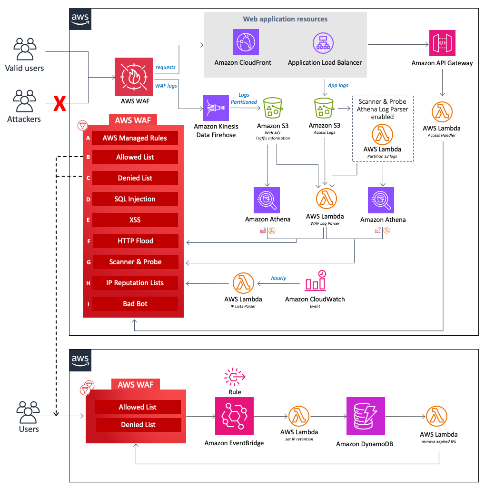

**Important: [Security Automations for AWS WAF](https://docs.aws.amazon.com/solutions/security-automations-for-aws-waf/) will retire in December 2026. Deployments (via CloudFormation or GitHub) will remain operational, but customers will assume responsibility for maintenance and API-related updates post-retirement. Customers can explore using native AWS WAF capabilities including [AWS Managed Rules](https://docs.aws.amazon.com/waf/latest/developerguide/aws-managed-rule-groups.html), native [rate-based rules](https://docs.aws.amazon.com/waf/latest/developerguide/waf-rule-statement-type-rate-based.html), and the [AWS WAF Console](https://console.aws.amazon.com/wafv2/) for intuitive configuration and management. These native capabilities provide superior functionality, better performance, real-time updates, and enhanced security features compared to the solution.**

**Customers running solution versions prior to v3.0.0 (which deployed AWS WAF Classic) should first migrate to AWS WAF v2 using the [AWS WAF migration documentation](https://docs.aws.amazon.com/waf/latest/developerguide/waf-migrating-from-classic.html). Customers on v3.0.0 or later are already on AWS WAF v2 and can directly adopt native managed rules and console-based management.**

**[🚀 Solution Landing Page](https://aws.amazon.com/solutions/implementations/security-automations-for-aws-waf)** | **[🚧 Feature request](https://github.com/aws-solutions/aws-waf-security-automations/issues/new?assignees=&labels=feature-request%2C+enhancement&template=feature_request.md&title=)** | **[🐛 Bug Report](https://github.com/aws-solutions/aws-waf-security-automations/issues/new?assignees=&labels=bug%2C+triage&template=bug_report.md&title=)**

**Note:** If you want to use the solution without building from source, navigate to Solution Landing Page.

## Table of contents

- [Solution Overview](#solution-overview)
- [Architecture Diagram](#architecture-diagram)
- [Customizing the Solution](#customizing-the-solution)
  - [Prerequisites for Customization](#prerequisites-for-customization)
  - [Build](#build)
  - [Upload Deployment Assets](#upload-deployment-assets)
  - [Deploy](#deploy)
- [File Structure](#file-structure)
- [License](#license)

---

# Solution overview

The Security Automations for AWS WAF solution automatically deploys a set of AWS WAF (web application firewall) rules that filter common web-based attacks. Users can select from preconfigured protective features that define the rules included in an AWS WAF web access control list (web ACL). Once deployed, AWS WAF protects your Amazon CloudFront distributions or Application Load Balancers by inspecting web requests.

You can use AWS WAF to create custom, application-specific rules that block attack patterns to ensure application availability, secure resources, and prevent excessive resource consumption.

You can install this solution in your AWS accounts by launching the provided AWS CloudFormation template.

For a detailed solution implementation guide, refer to Solution Landing Page [Security Automations for AWS WAF](https://aws.amazon.com/solutions/implementations/security-automations-for-aws-waf).

---

# Architecture diagram



*Security Automations for AWS WAF architecture*

The components of this solution can be grouped into the following areas of protection. 

**Note:** The group labels don’t reflect the priority level of the WAF rules.

* **AWS Managed Rules (A)** – This component contains AWS Managed Rules IP reputation rule groups, baseline rule groups, and use-case specific rule groups. These rule groups protect against exploitation of common application vulnerabilities or other unwanted traffic, including those described in OWASP publications, without having to write your own rules.
* **Manual IP lists (B and C)** – These components create two AWS WAF rules. With these rules, you can manually insert IP addresses that you want to allow or deny. You can also configure IP retention and remove expired IP addresses from these IP lists. 
* **SQL Injection (D) and XSS (E)** – These components configure two AWS WAF rules that are designed to protect against common SQL injection or cross-site scripting (XSS) patterns in the URI, query string, or body of a request.
* **HTTP Flood (F)** – This component protects against attacks that consist of a large number of requests from a particular IP address, such as a web-layer DDoS attack or a brute-force login attempt.
* **Scanner and Probe (G)** – This component parses application access logs searching for suspicious behavior, such as an abnormal amount of errors generated by an origin. Then it blocks those suspicious source IP addresses for a customer-defined period of time. 
* **IP Reputation Lists (H)** – This component is the IP Lists Parser Lambda function that checks third-party IP reputation lists hourly for new ranges to block. These lists include the Spamhaus Don’t Route Or Peer (DROP) and Extended DROP (EDROP) lists, the Proofpoint Emerging Threats IP list, and the Tor exit node list.
* **Bad Bot (I)** – This component enhances bad bot detection by monitoring direct connections to an Application Load Balancer (ALB) or Amazon CloudFront, in addition to the honeypot mechanism. If a bot bypasses the honeypot and attempts to interact with ALB or CloudFront, the system analyzes request patterns and logs to identify malicious activity. When a bad bot is detected, its IP address is extracted and added to an AWS WAF block list to prevent further access.
  Bad bot detection operates through a structured logic chain, ensuring comprehensive threat coverage:
  * HTTP Flood Protection Lambda Log Parser – Collects bad bot IPs from log entries during flood analysis.
  * Scanner & Probe Protection Lambda Log Parser – Identifies bad bot IPs from scanner-related log entries.
  * HTTP Flood Protection Athena Log Parser – Extracts bad bot IPs from Athena logs, using partitions across query run.
  * Scanner & Probe Protection Athena Log Parser – Retrieves bad bot IPs from scanner-related Athena logs, using the same partitioning strategy.
  * Fallback Detection – If both HTTP Flood Protection and Scanner & Probe Protection are disabled, the system relies on the Log Lambda parser, which logs bot activity based on AWS WAF label filters.

---


# Customizing the solution


## Prerequisites for customization

- [AWS Command Line Interface](https://aws.amazon.com/cli/)
- Python 3.12
- Poetry v2
- Node 22

## Build

Building from GitHub source allows you to modify the solution, such as adding custom actions or upgrading to a new release. The process consists of downloading the source from GitHub, creating Amazon S3 buckets to store artifacts for deployment, building the solution, and uploading the artifacts to S3 buckets in your AWS account.

#### 1. Clone the repository

Clone or download the repository to a local directory on your Linux client. 

**Note:** If you intend to modify the source code, can create your own fork of the GitHub repo and work from that. This way, you can check in your changes to your private copy of the solution.

**Git Clone example:**

```
git clone https://github.com/aws-solutions/aws-waf-security-automations.git
```

**Download Zip example:**

```
wget https://github.com/aws-solutions/aws-waf-security-automations/archive/master.zip
```

#### 2. Unit test

Next, run unit tests to ensure that your customized code passes the tests:

```
cd <rootDir>/deployment
chmod +x ./run-unit-tests.sh
./run-unit-tests.sh
```

#### 3. Create S3 buckets for storing deployment assets

AWS Solutions use two buckets:

- One global bucket that you access with the http endpoint. AWS CloudFormation templates are stored here. For example, `mybucket`.
- One regional bucket for each AWS Region where you plan to deploy the solution. Use the name of the global bucket as the prefix of the bucket name, and suffix it with the region name. Regional assets such as Lambda code are stored here. For example, `mybucket-us-east-1`.

The assets in buckets must be accessible by your account.

#### 4. Declare enviroment variables

```
export TEMPLATE_OUTPUT_BUCKET=<YOUR_TEMPLATE_OUTPUT_BUCKET> # Name of the global bucket where CloudFormation templates are stored
export DIST_OUTPUT_BUCKET=<YOUR_DIST_OUTPUT_BUCKET> # Name for the regional bucket where regional assets are stored
export SOLUTION_NAME=<SOLUTION_NAME> # name of the solution.
export VERSION=<VERSION> # version number for the customized code
export AWS_REGION=<AWS_REGION> # region where the solution is deployed
```

#### 5. Build the solution

```
cd <rootDir>/deployment
chmod +x ./build-s3-dist.sh && ./build-s3-dist.sh $TEMPLATE_OUTPUT_BUCKET $DIST_OUTPUT_BUCKET $SOLUTION_NAME $VERSION
```

**Note**: You must install Poetry version 2 to execute script. Since version 2, the `export` command is no longer included by default in Poetry. To use it, you need to install the `poetry-plugin-export` plugin.

## Upload deployment assets

```
aws s3 cp ./deployment/global-s3-assets s3://$TEMPLATE_OUTPUT_BUCKET/$SOLUTION_NAME/$VERSION --recursive --acl bucket-owner-full-control
aws s3 cp ./deployment/regional-s3-assets s3://$DIST_OUTPUT_BUCKET-$AWS_REGION/$SOLUTION_NAME/$VERSION --recursive --acl bucket-owner-full-control
```

**Note:** You must use a proper ACL and profile for the copy operation as applicable. Using randomized bucket names is recommended.


## Deploy

When deploying this solution you have two options:

#### 1. Option to deploy the template in the S3 bucket
- From your designated S3 bucket where you uploaded the deployment assets, copy the link location for the `aws-waf-security-automations.template` file.
- Using AWS CloudFormation, launch the Security Automations for AWS WAF solution stack using the copied Amazon S3 link for the `aws-waf-security-automations.template` file.

#### 2. Option to deploy using the ```cdk deploy``` command.

First you will need to run ```cd source/infrastructure``` in order to run the cdk deploy command.

With this option, you should specify a couple of the parameters depending on your use case. Otherwise the default values will be picked. If you decide to go with the default values make sure you specify the ```AppAccessLogBucket``` parameter otherwise your deployment will fail. For more information about our parameters you can read our Implementation guide.

An example cdk deploy command which specifies a couple parameters: 
```
cdk deploy AwsWafSecurityAutomations --parameters ActivateAWSManagedAIPParam=yes --parameters AppAccessLogBucket=appbucket --parameters ActivateScannersProbesProtectionParam="yes - Amazon Athena log parser"
```

**Note:** When deploying the template for your CloudFront endpoint, you can launch it only from the `us-east-1` Region.

---

# File structure

This project consists of microservices that facilitate the functional areas of the solution. These microservices are deployed to a serverless environment in AWS Lambda.

```
|-deployment/ [folder containing templates and build scripts]
|-source/
  |-custom_resource/        [custom helper for CloudFormation deployment template]
  |-helper/                 [custom helper for CloudFormation deployment dependency check and auxiliary functions]
  |-image/                  [folder containing images of the solution such as architecture diagram]
  |-infrastructure/         [the CDK app that wraps solution]
  |-lib/                    [library files including waf api calls and other common functions used in the solution]
  |-ip_retention_handler/   [lambda code for setting ip retention and removing expired ips]
  |-log_parser/             [microservice for processing access logs searching for suspicious behavior and add the corresponding source IP addresses to an AWS WAF block list]
  |-reputation_lists_parser/ [microservice for processing third-party IP reputation lists and add malicious IP addresses to an AWS WAF block list]
  |-timer/                   [creates a sleep function for cloudformation to pace the creation of ip_sets]
  |-metrics/                 [this lambda function is used to collect metrics for the requests blocked using the WAF ACL deployed by the solution]
```

---

## Data Collection

This solution sends operational metrics to AWS (the “Data”) about the use of this solution. We use this Data to better understand how customers use this solution and related services and products. AWS’s collection of this Data is subject to the [AWS Privacy Notice](https://aws.amazon.com/privacy/).


---

# License

See license [here](https://github.com/aws-solutions/aws-waf-security-automations/blob/master/LICENSE.txt).
